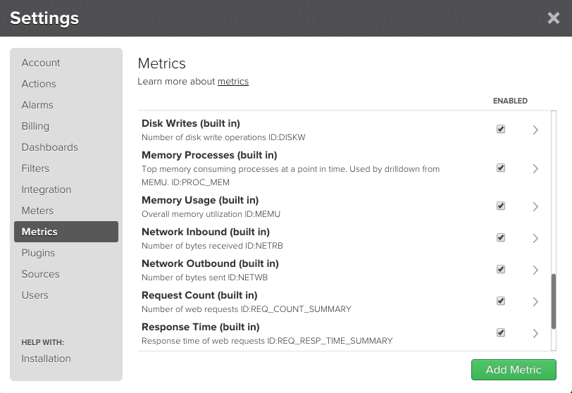
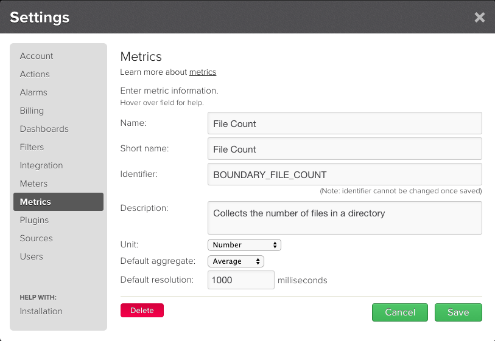

# Metric Definitions
Metric definitions in Boundary provide metadata about measurements input to the system. This page provides details on metric definitions including: how to define metrics, as well as best practices with respect to their naming.

A metric definition consists of 7 values:

* _Name_ - unique metric identifier
* _Display Name_ - Label used within the web interface.
* _Short Display Name_ - Shortened label used with the web interface.
* _Description_ - Text that describes the metric.
* _Default Aggregate_ - Type of aggregate displayed by default
* _Unit_ - Quantity measured by this metric

### Name
Metric identifiers are globally unique immutable keys within Boundary. Each metric definition is _owned_ by single account. If a metric definition contains a metric identifier already created by another account then an error will occur. Metric identifiers are referenced in the plugin manifest (see [Plugin Manifest](manifest.md)) and when a plugin is deployed in an account other then where the metric definitions were created, they are _copied_ into the new account.

Metric identifiers are case insenstive but by convention they are always in upper case letters (A-Z) with allowance for a underscore (-) or dash between logical words. This convention should be adhered to when defining or referencing a metric.

Metric identifiers from the same plugin should have a prefix to group similar metrics (e.g. `AWS_ELB_LATENCY`). Metric names that are prefixed with `BOUNDARY` should be considered reserved for Boundary’s internal use.

### Display Name
Display name is the primary label used by web user interface to reference a metric and/or its measurement. The display name appears in the following locations within the web user interface:

* Headings of graphs in dashboards
* List of items with the _metrics settings_ dialog
* Drop down list when defining an _Alarm_

Each display name should have a common prefix so that similar metrics are grouped together and provides a hint of the system or identity to be monitored (e.g. `APACHE_BYTES_PER_REQUEST`).

### Short Display Name
The short display name is used in cases where using there is limited space to use the display name as a label. For example the short display name is used as:

* List of items available metrics when editing a dashboard.
* Label when selecting a data point on a dashboard.

### Description
Should be a concise definition that describes the metric, if the metric is a rate, what are the units of the metric (e.g. x/second),etc.

When building a dashboard using the dashboard editor (_Settings_ => _Dashboards_), the list of available metrics is displayed on the left hand side of the dialog. Mousing over an item in the list displays the description as a [tool tip](http://en.wikipedia.org/wiki/Tooltip).

### Default Aggregate
Default aggregate indicates which type of aggregate is displayed in dashboards by default. The following aggregates are supported:

* _Average_
* _Maximum_
* _Minimum_
* _Sum_

### Unit
A metric quantity is described by a unit which is one of the following:
* _Count Of Bytes_
* _Duration_
* _Number_
* _Percentage_

### Default Resolution
Default resolution describes how often measurements for this metric will be updated. This value is used to extend the line on a dashboard to provide better visualization, instead of drawing single points.

## Defining Metrics

Metric definitions are defined in Boundary using either:

1. Web user interface
2. REST APIs
3. Command line utilities.

Details on the use of the REST APIs for metric definition can be found [here](http://premium-documentation.boundary.com/metrics). The remaining methods are described in the next sections.

### Defining Metrics Using the Web User Interface

1. Login into Boundary
2. Display the settings dialog by clicking on the _settings icon_ in the menu: 

3. Click on _Metrics_ in the left hand side of the dialog which then displays the _Metrics_ dialog:


4. Click on the _Create Metric_ button which displays a form to define a new metric. Fill out the form as shown here:


5. Click on the _Save_ button to create the metric.

6. Click on the _Close_ button to dismiss the dialog.

### Defining Metrics Using Command Line Utilities

1. Install the Boundary API CLI and configure according to instructions [here](https://github.com/boundary/boundary-api-cli)
2. Create the metric using metric-create:
```
$ metric-create -n BOUNDARY_FOO_METRIC_IN -d "Boundary Foo Metric In" -s "Foo In" -i "Tracks the Boundary Foo Metric" -g avg -i number -r 1000
{
  "result": {
    "success": true
  }
}
```